# code-to-graph

Transforms code (JS) into graphs (graphviz, mermaid flowchart, ...)

## Interactive Demo

https://crubier.github.io/code-to-graph/

[A bigger example](https://crubier.github.io/code-to-graph/?code=aW1wb3J0IHsgdG90byB9IGZyb20gInR1dHUiOwoKZnVuY3Rpb24gdHJ5Q2F0Y2hFeGFtcGxlKGFyZ3MpIHsKICBmdW5jdGlvbiBmKCkgewogICAgY29uc3QgZCA9IGFzeW5jICgpID0-IHsKICAgICAgYXdhaXQgNTsKICAgICAgcmV0dXJuIHRvdG87CiAgICB9OwogICAgY29uc3QgZmYgPSA0NTsKICAgIHRyeSB7CiAgICAgIGxldCBhID0gNTsKICAgICAgYSA9IGEgKyAxOwogICAgICBpZiAoYSA-IDMpIHsKICAgICAgICB0aHJvdyBuZXcgRXJyb3IoIm5vdCBub3JtYWwiKTsKICAgICAgfQogICAgfSBjYXRjaCAoZSkgewogICAgICBjb25zb2xlLmxvZygiaW4gdGhlIGNhdGNoIik7CiAgICAgIGlmICh2KSByZXR1cm4gNTsKICAgICAgaWYgKGZ0dykgdGhyb3cgbmV3IEVycm9yKCJSZWFsIGJhZCIpOwogICAgfSBmaW5hbGx5IHsKICAgICAgY29uc29sZS5sb2coImluIHRoZSBmaW5hbGx5Iik7CiAgICAgIGlmICh1KSByZXR1cm4gODsKICAgIH0KICAgIHJldHVybiAxOwogIH0KfQoKZXhwb3J0IGFzeW5jIGZ1bmN0aW9uKiBnZW5lcmF0b3JFeGFtcGxlKGFyZ3MpIHsKICB5aWVsZCAxOwogIHlpZWxkIDU7CiAgaWYgKG15Q29uZCkgewogICAgY29uc3QgYyA9IHlpZWxkIDIxOwogICAgY29uc3QgZCA9IGF3YWl0IGNvY28oYyk7CiAgfSBlbHNlIHsKICAgIHlpZWxkIDI1OwogICAgbGV0IHUgPSB5aWVsZCBmKDQ1ICsgNik7CiAgfQogIGZvciBhd2FpdCAobGV0IGEgb2YgYikgewogICAgY29uc3QgYiA9IGF3YWl0IGYoYSk7CiAgICB5aWVsZCBiICsgYjsKICAgIGZyYW1lRWxlbWVudCgyKTsKICAgIGNvbnN0IHUgPSB5aWVsZCA2OwogIH0KICByZXR1cm4gZDsKfQoKYXN5bmMgZnVuY3Rpb24gY29udHJvbEZsb3dFeGFtcGxlKHgpIHsKICBjb25zdCBhID0gNTsKICBjb25zdCBiID0gYXdhaXQgdG90byg0NCk7CiAgd2hpbGUgKGIgPiAwKSB7CiAgICBpZiAoYikgewogICAgICByZXR1cm4gNTsKICAgIH0gZWxzZSBpZiAoYykgewogICAgICB0aHJvdyBuZXcgRXJyb3IoIk5vdCIpOwogICAgfSBlbHNlIHsKICAgICAgYiA9IDUyOwogICAgfQogIH0KICBkbyB7CiAgICBiID0gYiArIDE7CiAgICBjID0gZihrKTsKICAgIGlmIChrKSB7CiAgICAgIGJyZWFrOwogICAgfQogIH0gd2hpbGUgKGIgPCA0KTsKICBpZiAoaysrID09IDUpIHsKICAgIGNvdWNvdTIgPSAyNDsKICB9CiAgZm9yIChsZXQgdCA9IDA7IHQgPCA1OyB0KyspIHsKICAgIGlmIChsKSB7CiAgICAgIGYoaCk7CiAgICB9IGVsc2UgewogICAgICB3ZWJraXRDYW5jZWxBbmltYXRpb25GcmFtZSgzMik7CiAgICB9CiAgfQogIHJldHVybiBhICogMzsKfQoKY2xhc3MgRXhhbXBsZUNsYXNzIHsKICBteU1ldGhvZCh4KSB7CiAgICBjb25zb2xlLmxvZygibG9sIik7CiAgICByZXR1cm47CiAgfQogIGV4YW1wbGVNZXRob2QoeCkgewogICAgaWYgKG15Q29uZGl0aW9uKSByZXR1cm4gNTsKICAgIHJldHVybiA2OwogIH0KICBwcm9wZXJ0eSA9IDg7CiAgc3RhdGljIHN0YXRpY1Byb3AgPSAxOTsKICByZW5kZXIoKSB7CiAgICByZXR1cm4gKAogICAgICA8ZGl2PgogICAgICAgIDxzcGFuPlRvdG88L3NwYW4-CiAgICAgICAgPHNwYW4-VGl0aTwvc3Bhbj4KICAgICAgPC9kaXY-CiAgICApOwogIH0KfQoKZXhwb3J0IGRlZmF1bHQgdG90bzsK)

## CLI Usage

Call the cli with a js file name, it prints out the Mermaid.js graph definition

```bash
yarn global add code-to-graph
code-to-graph example.js
```

To see the result visualy, paste it in

https://mermaidjs.github.io/mermaid-live-editor

Or you can use it on gitlab using the ```mermaid language in comments, descriptions or markdown files.

## Explanation

Turns this:

```javascript
x => {
  const a = f(x);
  if (x === 0) {
    let a = null;
    throw new Error("Nooes");
  } else {
    const c = 8;
    return 4;
  }
};
```

Into this:


Whichs renders into this:


