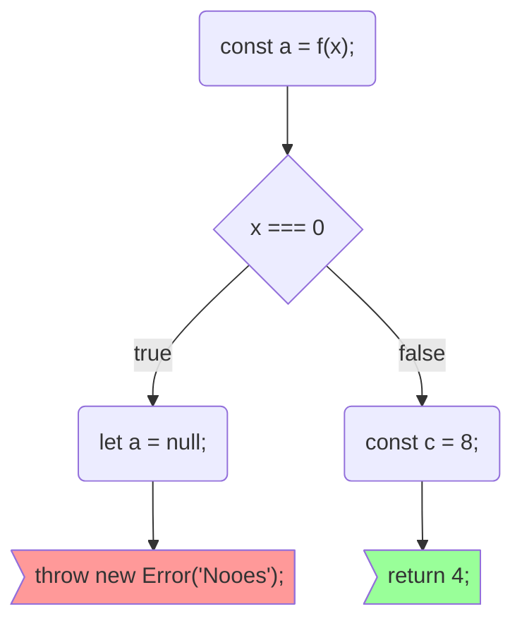

# code-to-graph

Transforms code (JS) into graphs (graphviz, mermaid flowchart, ...)

Turns this:

```javascript
x => {
  const a = f(x);
  if (x === 0) {
    let a = null;
    throw new Error("Nooes");
  } else {
    const c = 8;
    return 4;
  }
};
```

Into this:



Whichs renders into this:


# Usage

Call the cli with a js file name, it prints out the Mermaid.js graph definition

```bash
code-to-graph example.js
```
